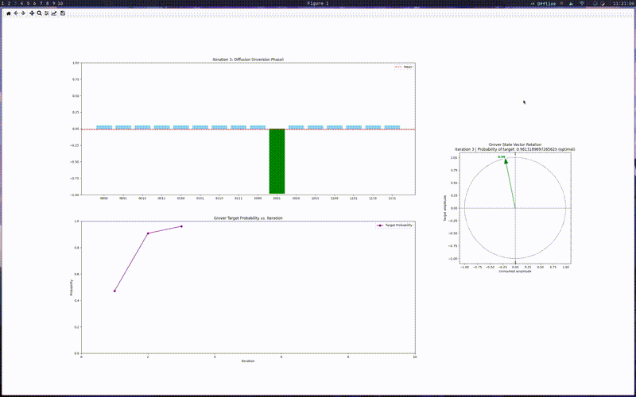

# Grover’s Search Visualizer

A tiny Python package that steps through Grover’s Search algorithm and shows you, after each iteration:

- A bar‐chart of amplitudes (or probabilities)
- A sine‐curve of success‐probability vs. iteration
- A geometric "rotation" on the unit circle

---



---

## Installation

### Using [uv](https://docs.astral.sh/uv/)/[uvx](https://docs.astral.sh/uv/guides/tools/)

```bash
uvx grovers-visualizer 1111
```

### Using [pip](https://pypi.org/project/pip/)/[pipx](https://pipx.pypa.io/stable/installation/)

```bash
pip grovers-visualizer
# or
pipx grovers-visualizer # (recommended)

# and then run
grovers-visualizer
```

---

## Usage

### Flags

- `TARGET`  
 Target bit‐string (e.g. `010`). Length also determines number of qubits.  
- `-i, --iterations ITERATIONS`  
 Max iterations; `0` means use the optimal $\lfloor\frac\pi4\sqrt{2^n}\rfloor$.  
- `-s, --speed SPEED`  
 Delay between iterations (seconds). Default `0.5`.  
- `-p, --phase PHASE`  
  The phase $\psi$ (in radians) used for both the oracle and diffusion steps. Defaults to $\pi$ (i.e. a sign-flip, $e^{i\pi}=-1$).

---

## License

This project is licensed under the MIT License - see the [LICENSE](LICENSE) file for details.
